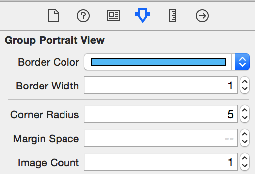
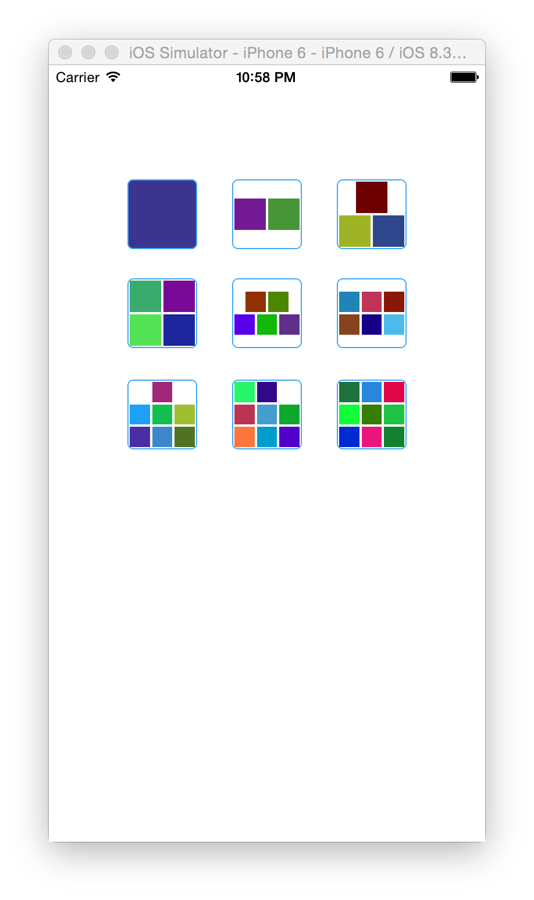

# LDGroupPortraitView 仿微信群组头像功能

## 使用方法

将LDGroupPortraitView.swift拖到项目中，在storeboard或者xib文件中，拖一个UIView，并更改为LDGroupPortraitView，可在右边的Attribute inspector可修改相关属性。

代码中可修改显示图片：

```
var imagesUrls = [
            "http://www.louding.com:3022/imGetFile/IbWkedvJgcYAMkK1429516161645.png",
            "http://www.louding.com:3022/imGetFile/IbWkedvJgcYAMkK1429516161645.png",
            "http://www.louding.com:3022/imGetFile/IbWkedvJgcYAMkK1429516161645.png",
        "http://www.louding.com:3022/imGetFile/IbWkedvJgcYAMkK1429516161645.png"]
        
portraitView.setImageUrls(imagesUrls, defaultImage: UIImage(named: "touxiang")!)
        
```







